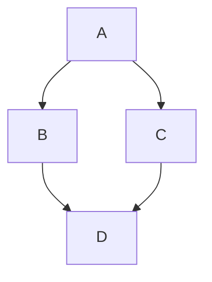
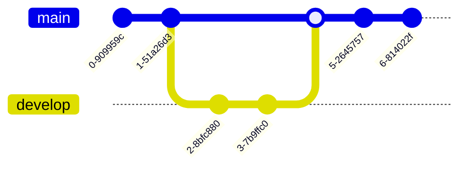

# mermaid-sample
a simple sample of how the mermaid UML works

##simple diagram

```mermaid
  graph TD;
      A-->B;
      A-->C;
      B-->D;
      C-->D;
```

## A git commit diagram

```mermaid
    gitGraph
       commit
       commit
       branch develop
       checkout develop
       commit
       commit
       checkout main
       merge develop
       commit
       commit
```

